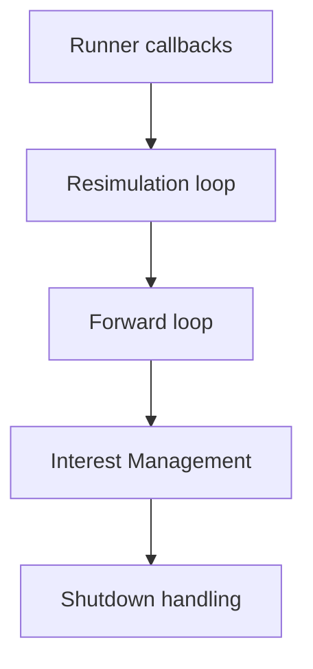

---
{"dg-publish":true,"permalink":"/arcitecture-overview/fusion/fusion-gameloop/","tags":["Architecture","Info","Fusion"],"dg-note-properties":{"tags":["Architecture","Info","Fusion"]}}
---

[[_Assets/Photon Fusion 2\|Photon Fusion 2]]

# Fusion gameloop

> [!summary] Коротко
> Gameplay-state меняется в `FixedUpdateNetwork()`. Visuals/interpolation — в `Render()`.

## Loop layers
1. Unity `FixedUpdate()`
2. Fusion `FixedUpdateNetwork()`
3. Unity `Update()`
4. Fusion `Render()`
5. Unity `LateUpdate()`

## Fusion update loop

## Resimulation
- Только `ServerMode` / `HostMode` clients.
- Fusion получает authoritative state.
- Откатывает local state к последнему valid snapshot.
- Пересчитывает ticks до текущего predicted tick.
- Нужен для client-side prediction.

## Forward
- Работает во всех modes.
- Симулирует следующий tick/ticks.
- В `SharedMode` — основной simulation loop.
- Использует input и текущий state.

## NetworkBehaviour callbacks
| Callback | Для чего |
|---|---|
| `Spawned()` | объект attached, network state/RPC доступны |
| `FixedUpdateNetwork()` | gameplay simulation на tick |
| `Render()` | visuals, interpolation, animation, VFX |
| `Despawned()` | cleanup перед despawn |

## Правила
- Не писать gameplay-state в `Update()` / `Render()`.
- Не читать `[Networked]` до `Spawned()`.
- Использовать `Runner.DeltaTime`, не `Time.deltaTime`, в simulation.
- Input:
  - poll на client с `Input Authority`
  - consume в `FixedUpdateNetwork()`
- Physics/gameplay — deterministic-ish, tick-based.
- Camera/VFX/UI — frame-based, в `Render()` / Unity lifecycle.

## Tick
- Tick rate задаётся в `NetworkProjectConfig`.
- Tick rate != FPS.
- Snapshot = state на tick.
- `FixedUpdateNetwork()` вызывается один раз на simulation tick.

## Docs
- [Fusion Update Loop](https://doc.photonengine.com/fusion/current/concepts-and-patterns/fusion-update-loop)
- [Network Simulation Loop](https://doc.photonengine.com/fusion/current/concepts-and-patterns/network-simulation-loop)
- [Network Behaviour](https://doc.photonengine.com/fusion/current/manual/network-behaviour)
